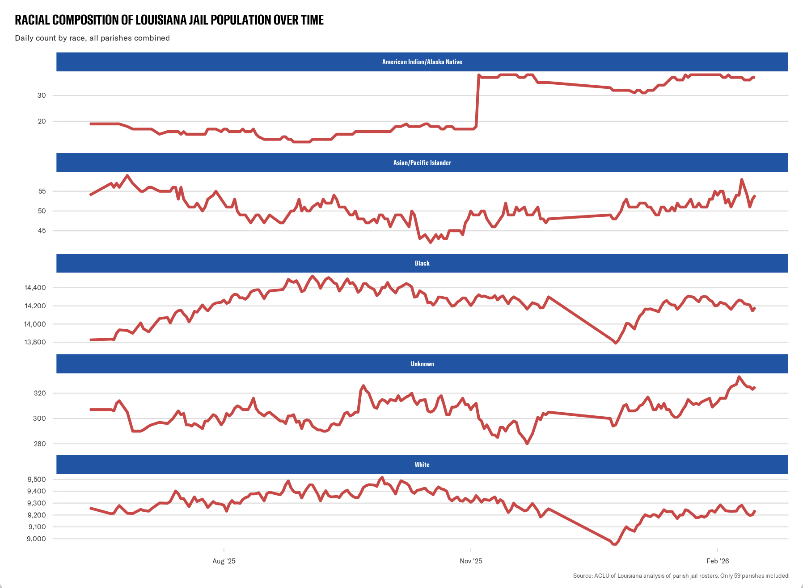

# Louisiana Jail Data
An automated scraper that collects inmate roster data from Louisiana parish jails and police departments using GitHub Actions.

## Updates
- **`April 24th, 2026`**: Updated to fix the encryption, to instead make it a cypher. This allows us to compare encrypted names / encrypted dates of birth across time. We also condensed the past 30+ days of downloads with the previous rosters. This gives us 7,000,000+ records.
## What it does
Every day at 6:00 PM CST, the GitHub Actions workflow scrapes inmate roster tables from 72 Louisiana parish jails and police departments listed in `links.csv`. This includes 61 out of 64 parishes and 11 municipal jails. Scraped data is saved as a timestamped CSV in the `downloads/` folder and committed to the repo. Sensitive fields (`Name` and `DOB`) are encrypted using RSA public-key encryption before being committed. If you need this information, please contact me at `eappelson@laaclu.org`.
> [!NOTE] 
> This data includes both those held pretrial and post-conviction. Additionally, historical rosters were scraped from [here](https://jailrosters.org/), and the resulting dataframe is saved in `downloads` as `rosters.rds`. Sensitive data is hashed.
## Files
- `script.py`: Scrapes all jails and encrypts sensitive columns before saving
- `encrypt.py`: Encryption utility
- `decrypt.py`: Decrypts CSVs locally using the private key
- `jail_scraper.r`: Scrapes data from the past year saved [here](https://jailrosters.org/).
- `links.csv`: List of 80 jail roster URLs with associated jail names
- `.github/workflows/main.yml`: GitHub Actions workflow that runs the scraper
## Warning
This code should NEVER be replicated or repurposed to scrape and track individuals held in jail. This project exists solely for research and accountability purposes. Do not misuse this code or data to monitor, target, or surveil incarcerated individuals.

---

## Parish Breakdown

_Last updated: 2026-05-01 02:42 UTC_

**Total inmates (latest scrape):** 25,733 across 72 parishes/jails

### Acadia Parish
**Total:** 168

| Race | Count | % |
|------|-------|---|
| White | 90 | 53.6% |
| Black | 76 | 45.2% |
| Asian/PacificIslander | 1 | 0.6% |
| American Indian/Alaska Native | 1 | 0.6% |

### Allen Parish
**Total:** 131

| Race | Count | % |
|------|-------|---|
| White | 82 | 62.6% |
| Black | 47 | 35.9% |
| Unknown | 1 | 0.8% |
| American Indian/Alaska Native | 1 | 0.8% |

### Ascension Parish
**Total:** 505

| Race | Count | % |
|------|-------|---|
| Black | 266 | 52.7% |
| White | 201 | 39.8% |
| Unknown | 34 | 6.7% |
| Asian/PacificIslander | 4 | 0.8% |

### Assumption Parish
**Total:** 143

| Race | Count | % |
|------|-------|---|
| Unknown | 72 | 50.3% |
| White | 71 | 49.7% |

### Avoyelles Parish
**Total:** 394

| Race | Count | % |
|------|-------|---|
| Black | 206 | 52.3% |
| White | 181 | 45.9% |
| Unknown | 6 | 1.5% |
| Asian/PacificIslander | 1 | 0.3% |

### Beauregard Parish
**Total:** 177

| Race | Count | % |
|------|-------|---|
| White | 124 | 70.1% |
| Black | 53 | 29.9% |

### Bienville Parish
**Total:** 39

| Race | Count | % |
|------|-------|---|
| White | 23 | 59.0% |
| Unknown | 16 | 41.0% |

### Bogalusa Police Department
**Total:** 23

| Race | Count | % |
|------|-------|---|
| Black | 13 | 56.5% |
| White | 10 | 43.5% |

### Bossier City Police Department
**Total:** 45

| Race | Count | % |
|------|-------|---|
| Black | 28 | 62.2% |
| White | 17 | 37.8% |

### Bossier Parish
**Total:** 1,127

| Race | Count | % |
|------|-------|---|
| Black | 619 | 54.9% |
| White | 505 | 44.8% |
| Unknown | 2 | 0.2% |
| American Indian/Alaska Native | 1 | 0.1% |

### Caddo Parish
**Total:** 1,578

| Race | Count | % |
|------|-------|---|
| Black | 1,169 | 74.1% |
| White | 373 | 23.6% |
| Unknown | 33 | 2.1% |
| Asian/PacificIslander | 3 | 0.2% |

### Calcasieu Parish
**Total:** 1,026

| Race | Count | % |
|------|-------|---|
| Black | 550 | 53.6% |
| White | 431 | 42.0% |
| Unknown | 43 | 4.2% |
| Asian/PacificIslander | 2 | 0.2% |

### Caldwell Parish
**Total:** 604

| Race | Count | % |
|------|-------|---|
| Black | 392 | 64.9% |
| White | 191 | 31.6% |
| American Indian/Alaska Native | 20 | 3.3% |
| Unknown | 1 | 0.2% |

### Cameron Parish
**Total:** 20

| Race | Count | % |
|------|-------|---|
| White | 19 | 95.0% |
| Black | 1 | 5.0% |

### Catahoula Parish
**Total:** 132

| Race | Count | % |
|------|-------|---|
| Black | 93 | 70.5% |
| White | 38 | 28.8% |
| Unknown | 1 | 0.8% |

### Claiborne Parish
**Total:** 637

| Race | Count | % |
|------|-------|---|
| Black | 383 | 60.1% |
| White | 254 | 39.9% |

### Concordia Parish
**Total:** 825

| Race | Count | % |
|------|-------|---|
| White | 458 | 55.5% |
| Black | 363 | 44.0% |
| Unknown | 4 | 0.5% |

### DeSoto Parish
**Total:** 119

| Race | Count | % |
|------|-------|---|
| Black | 76 | 63.9% |
| White | 42 | 35.3% |
| Asian/PacificIslander | 1 | 0.8% |

### East Baton Rouge Parish
**Total:** 1,046

| Race | Count | % |
|------|-------|---|
| Black | 798 | 76.3% |
| White | 196 | 18.7% |
| Unknown | 51 | 4.9% |
| Asian/PacificIslander | 1 | 0.1% |

### East Feliciana Parish
**Total:** 269

| Race | Count | % |
|------|-------|---|
| Black | 164 | 61.0% |
| White | 104 | 38.7% |
| Asian/PacificIslander | 1 | 0.4% |

### Evangeline Parish
**Total:** 82

| Race | Count | % |
|------|-------|---|
| White | 43 | 52.4% |
| Black | 38 | 46.3% |
| Unknown | 1 | 1.2% |

### Franklin Parish
**Total:** 848

| Race | Count | % |
|------|-------|---|
| Black | 551 | 65.0% |
| White | 286 | 33.7% |
| Unknown | 10 | 1.2% |
| Asian/PacificIslander | 1 | 0.1% |

### Hammond Police Department
**Total:** 9

| Race | Count | % |
|------|-------|---|
| Black | 5 | 55.6% |
| White | 4 | 44.4% |

### Iberia Parish
**Total:** 446

| Race | Count | % |
|------|-------|---|
| Black | 275 | 61.7% |
| White | 165 | 37.0% |
| Asian/PacificIslander | 3 | 0.7% |
| Unknown | 2 | 0.4% |
| American Indian/Alaska Native | 1 | 0.2% |

### Iberville Parish
**Total:** 101

| Race | Count | % |
|------|-------|---|
| Black | 63 | 62.4% |
| White | 35 | 34.7% |
| Unknown | 3 | 3.0% |

### Jackson Parish
**Total:** 1

| Race | Count | % |
|------|-------|---|
| Unknown | 1 | 100.0% |

### Jefferson Davis Parish
**Total:** 153

| Race | Count | % |
|------|-------|---|
| Black | 74 | 48.4% |
| White | 74 | 48.4% |
| American Indian/Alaska Native | 3 | 2.0% |
| Asian/PacificIslander | 1 | 0.7% |
| Unknown | 1 | 0.7% |

### Jefferson Parish
**Total:** 1,163

| Race | Count | % |
|------|-------|---|
| Black | 764 | 65.7% |
| White | 387 | 33.3% |
| Unknown | 8 | 0.7% |
| Asian/PacificIslander | 4 | 0.3% |

### Kinder Police Department
**Total:** 1

| Race | Count | % |
|------|-------|---|
| Black | 1 | 100.0% |

### LaSalle Parish
**Total:** 73

| Race | Count | % |
|------|-------|---|
| White | 51 | 69.9% |
| Black | 21 | 28.8% |
| Unknown | 1 | 1.4% |

### Lafayette Parish
**Total:** 838

| Race | Count | % |
|------|-------|---|
| Black | 531 | 63.4% |
| White | 295 | 35.2% |
| Unknown | 12 | 1.4% |

### Lafourche Parish
**Total:** 737

| Race | Count | % |
|------|-------|---|
| Black | 377 | 51.2% |
| White | 353 | 47.9% |
| American Indian/Alaska Native | 5 | 0.7% |
| Unknown | 1 | 0.1% |
| Asian/PacificIslander | 1 | 0.1% |

### Leesville Police Department
**Total:** 3

| Race | Count | % |
|------|-------|---|
| White | 2 | 66.7% |
| Black | 1 | 33.3% |

### Lincoln Parish
**Total:** 364

| Race | Count | % |
|------|-------|---|
| Black | 271 | 74.5% |
| White | 91 | 25.0% |
| Unknown | 2 | 0.5% |

### Livingston Parish
**Total:** 816

| Race | Count | % |
|------|-------|---|
| White | 589 | 72.2% |
| Black | 218 | 26.7% |
| Unknown | 7 | 0.9% |
| Asian/PacificIslander | 1 | 0.1% |
| American Indian/Alaska Native | 1 | 0.1% |

### Madison Parish
**Total:** 142

| Race | Count | % |
|------|-------|---|
| Black | 111 | 78.2% |
| White | 30 | 21.1% |
| Unknown | 1 | 0.7% |

### Morehouse Parish
**Total:** 208

| Race | Count | % |
|------|-------|---|
| Black | 142 | 68.3% |
| White | 66 | 31.7% |

### Natchitoches Parish
**Total:** 198

| Race | Count | % |
|------|-------|---|
| Black | 146 | 73.7% |
| White | 48 | 24.2% |
| Unknown | 3 | 1.5% |
| Asian/PacificIslander | 1 | 0.5% |

### Oakdale Police Department
**Total:** 6

| Race | Count | % |
|------|-------|---|
| Black | 3 | 50.0% |
| White | 3 | 50.0% |

### Opelousas Police Department
**Total:** 1

| Race | Count | % |
|------|-------|---|
| African American | 1 | 100.0% |

### Orleans Parish
**Total:** 1,380

| Race | Count | % |
|------|-------|---|
| Black | 1,182 | 85.7% |
| White | 174 | 12.6% |
| Unknown | 21 | 1.5% |
| Asian/PacificIslander | 3 | 0.2% |

### Ouachita Parish
**Total:** 1,271

| Race | Count | % |
|------|-------|---|
| Black | 846 | 66.6% |
| White | 410 | 32.3% |
| Unknown | 15 | 1.2% |

### Plaquemines Parish
**Total:** 633

| Race | Count | % |
|------|-------|---|
| Black | 415 | 65.6% |
| White | 198 | 31.3% |
| Unknown | 12 | 1.9% |
| Asian/PacificIslander | 7 | 1.1% |
| American Indian/Alaska Native | 1 | 0.2% |

### Pointe Coupee Parish
**Total:** 103

| Race | Count | % |
|------|-------|---|
| Black | 68 | 66.0% |
| White | 34 | 33.0% |
| Unknown | 1 | 1.0% |

### Rapides Parish
**Total:** 978

| Race | Count | % |
|------|-------|---|
| Black | 609 | 62.3% |
| White | 351 | 35.9% |
| Unknown | 16 | 1.6% |
| Asian/PacificIslander | 2 | 0.2% |

### Red River Parish
**Total:** 38

| Race | Count | % |
|------|-------|---|
| Black | 24 | 63.2% |
| White | 13 | 34.2% |
| Asian/PacificIslander | 1 | 2.6% |

### Richland Parish
**Total:** 717

| Race | Count | % |
|------|-------|---|
| Black | 494 | 68.9% |
| White | 213 | 29.7% |
| Unknown | 7 | 1.0% |
| Asian/PacificIslander | 3 | 0.4% |

### Sabine Parish
**Total:** 177

| Race | Count | % |
|------|-------|---|
| White | 101 | 57.1% |
| Black | 76 | 42.9% |

### Shreveport Police Department
**Total:** 39

| Race | Count | % |
|------|-------|---|
| Black | 32 | 82.1% |
| White | 7 | 17.9% |

### St. Bernard Parish
**Total:** 224

| Race | Count | % |
|------|-------|---|
| Black | 128 | 57.1% |
| White | 93 | 41.5% |
| Asian/PacificIslander | 2 | 0.9% |
| Unknown | 1 | 0.4% |

### St. Charles Parish
**Total:** 178

| Race | Count | % |
|------|-------|---|
| Unknown | 105 | 59.0% |
| White | 73 | 41.0% |

### St. Helena Parish
**Total:** 76

| Race | Count | % |
|------|-------|---|
| Black | 56 | 73.7% |
| White | 15 | 19.7% |
| Unknown | 4 | 5.3% |
| American Indian/Alaska Native | 1 | 1.3% |

### St. James Parish
**Total:** 75

| Race | Count | % |
|------|-------|---|
| Black | 61 | 81.3% |
| White | 14 | 18.7% |

### St. John the Baptist Parish
**Total:** 202

| Race | Count | % |
|------|-------|---|
| Unknown | 126 | 62.4% |
| White | 76 | 37.6% |

### St. Landry Parish
**Total:** 112

| Race | Count | % |
|------|-------|---|
| Black | 70 | 62.5% |
| White | 40 | 35.7% |
| Unknown | 2 | 1.8% |

### St. Martin Parish
**Total:** 198

| Race | Count | % |
|------|-------|---|
| Black | 99 | 50.0% |
| White | 92 | 46.5% |
| Unknown | 6 | 3.0% |
| American Indian/Alaska Native | 1 | 0.5% |

### St. Mary Parish
**Total:** 241

| Race | Count | % |
|------|-------|---|
| Black | 121 | 50.2% |
| White | 119 | 49.4% |
| Asian/PacificIslander | 1 | 0.4% |

### St. Tammany Parish
**Total:** 814

| Race | Count | % |
|------|-------|---|
| White | 414 | 50.9% |
| Black | 359 | 44.1% |
| Unknown | 36 | 4.4% |
| Asian/PacificIslander | 3 | 0.4% |
| American Indian/Alaska Native | 2 | 0.2% |

### Sulphur Police Department
**Total:** 15

| Race | Count | % |
|------|-------|---|
| White | 13 | 86.7% |
| Black | 2 | 13.3% |

### Tangipahoa Parish
**Total:** 632

| Race | Count | % |
|------|-------|---|
| Black | 385 | 60.9% |
| White | 246 | 38.9% |
| Unknown | 1 | 0.2% |

### Tensas Parish
**Total:** 563

| Race | Count | % |
|------|-------|---|
| Black | 371 | 65.9% |
| White | 176 | 31.3% |
| Unknown | 16 | 2.8% |

### Terrebonne Parish
**Total:** 468

| Race | Count | % |
|------|-------|---|
| Black | 246 | 52.6% |
| White | 216 | 46.2% |
| American Indian/Alaska Native | 6 | 1.3% |

### Vermillion Parish
**Total:** 131

| Race | Count | % |
|------|-------|---|
| White | 72 | 55.0% |
| Black | 57 | 43.5% |
| Unknown | 2 | 1.5% |

### Vernon Parish
**Total:** 155

| Race | Count | % |
|------|-------|---|
| White | 108 | 69.7% |
| Black | 44 | 28.4% |
| Unknown | 2 | 1.3% |
| Asian/PacificIslander | 1 | 0.6% |

### Ville Platte Police Department
**Total:** 31

| Race | Count | % |
|------|-------|---|
| Black | 18 | 58.1% |
| White | 12 | 38.7% |
| Unknown | 1 | 3.2% |

### Washington Parish
**Total:** 155

| Race | Count | % |
|------|-------|---|
| Black | 81 | 52.3% |
| White | 74 | 47.7% |

### Webster Parish
**Total:** 435

| Race | Count | % |
|------|-------|---|
| Black | 215 | 49.4% |
| White | 215 | 49.4% |
| Unknown | 3 | 0.7% |
| Asian/PacificIslander | 2 | 0.5% |

### West Baton Rouge Parish
**Total:** 134

| Race | Count | % |
|------|-------|---|
| Black | 81 | 60.4% |
| White | 48 | 35.8% |
| Unknown | 4 | 3.0% |
| Asian/PacificIslander | 1 | 0.7% |

### West Carroll Parish
**Total:** 30

| Race | Count | % |
|------|-------|---|
| White | 26 | 86.7% |
| Black | 4 | 13.3% |

### West Felician Parish
**Total:** 183

| Race | Count | % |
|------|-------|---|
| Black | 111 | 60.7% |
| White | 72 | 39.3% |

### Winn Parish
**Total:** 145

| Race | Count | % |
|------|-------|---|
| White | 74 | 51.0% |
| Black | 71 | 49.0% |

### Winnfield Police Department
**Total:** 2

| Race | Count | % |
|------|-------|---|
| Black | 2 | 100.0% |
